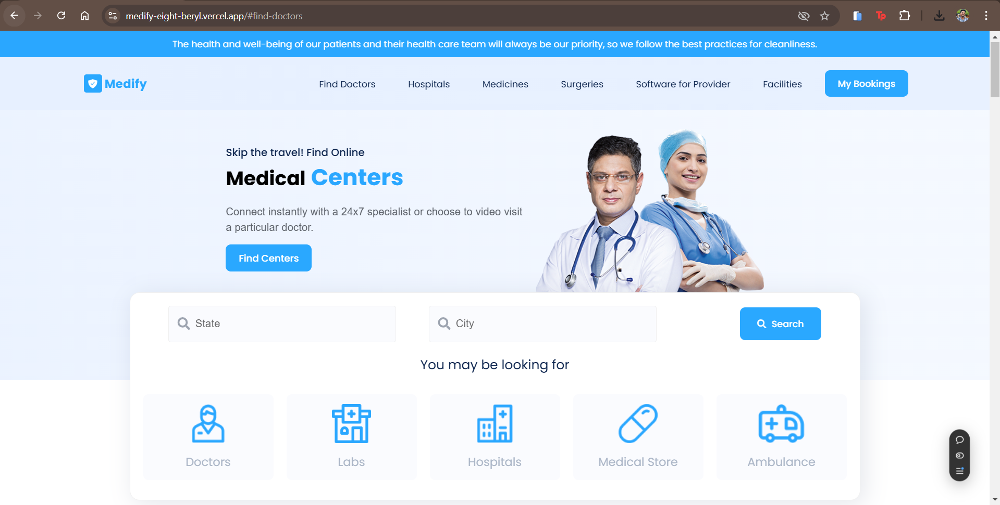
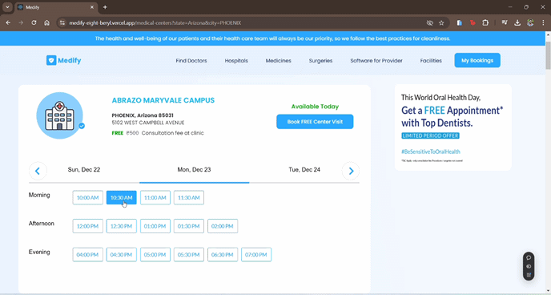
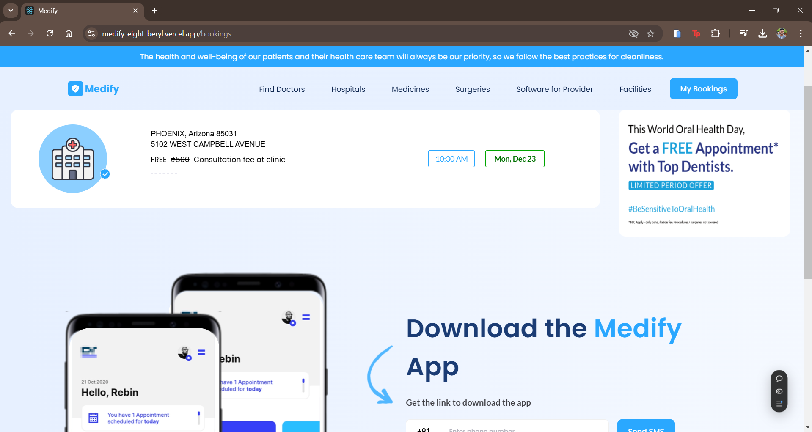

# Medify - A Responsive Medical Service Platform

## Overview

**Medify** is a responsive medical services platform built with **React** to showcase front-end development skills. This project is part of a **Full Stack Development course** that focuses on transitioning from non-IT to IT roles. The project is centered on utilizing **React**, **JavaScript**, **CSS**, and building **responsive web applications**. It includes a variety of features, such as hospital listings, service details, booking forms, and news sections, with booking data temporarily stored in **local storage**.

The project was designed with reference to web design specifications and assets from **Figma**, following the course-provided designs. All visual assets, dimensions, and logos were sourced from **Figma**, which helped maintain the design consistency across all components. 

## Installation

To clone and set up this project on your local machine:

1. Clone the repository using the command below:
   ```bash
   git clone https://github.com/Sai-Karthik9113/Medify.git
   ```

2. Navigate into the project directory:
   ```bash
   cd medify
   ```

3. Install the required dependencies:
   ```bash
   npm install
   ```

4. Start the development server:
   ```bash
   npm start
   ```

5. Visit `http://localhost:3000` in your browser to see the application running.

6. You can start using the application by navigating through the components like **Navbar**, **Home**, **MyBookings**, etc., and interact with the responsive UI.

## Folder Structure

```
/src
  /assets                # Images and icons used throughout the app
  /components            # Reusable components (e.g., Navbar, Button, SearchBox)
  /pages                 # Pages representing sections of the app (e.g., Home, MyBookings)
  /styles                # Global and component-specific styles (e.g., NavBar.module.css)
  /utils                 # Utility functions like uniqueId
  App.js                 # Main application component
  index.js               # Entry point for React
```

## Features

- **Hospital Listings & Services**: Displays hospitals and associated services with details on each.
- **Booking & News**: A user can submit booking forms for medical consultations, with a news section showing health-related articles.
- **Responsive Design**: The platform is designed to function seamlessly on different screen sizes—mobile, tablet, and desktop.
- **Local Storage**: User's booking data is temporarily saved in **local storage** and can be retrieved as needed for validation.
- **User Interface**: Clean and accessible UI with intuitive navigation, easy-to-use forms, and a pleasant design.

## Screenshots

Here are some screenshots showcasing the different sections and features of the app:

- **Home Page**:
  

- **Search Function**:
  

- **Medical Centers Page**:
  

- **Appointment Booking (Dates & Time Slots Available)**:
  

- **Appointment Booking**:
  

- **My Bookings Page**:
  

- **Responsive Mobile View**:
  

- **Demo Video (Mobile Screens)**

   Here’s a mobile-responsive demo of the application:

   


## Built With

- **React.js** - For creating interactive UI components and handling state management.
- **JavaScript** - For core functionality, user interaction, and utilizing local storage.
- **CSS** - For styling the application, creating responsive layouts, and ensuring consistent design.
- **Figma** - Used for design references (dimensions, size, layout) and downloading necessary images and logos based on course-provided designs.
- **VS Code** - Development environment used for writing and editing code.

## License

This project is open source and available under the MIT License.

